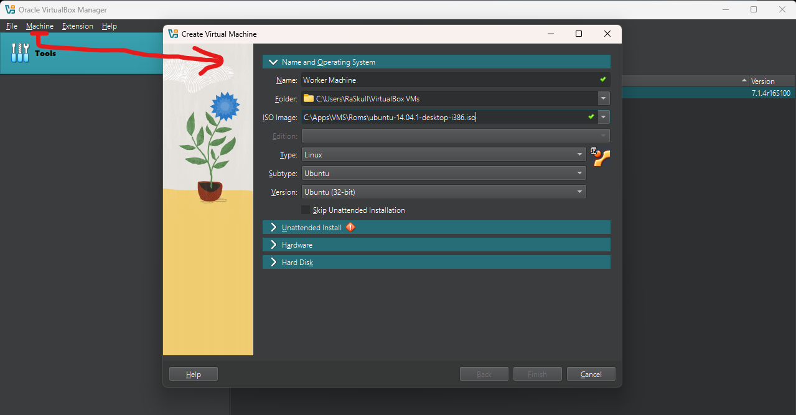
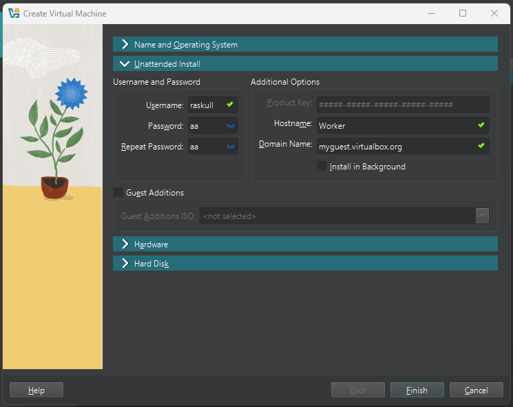
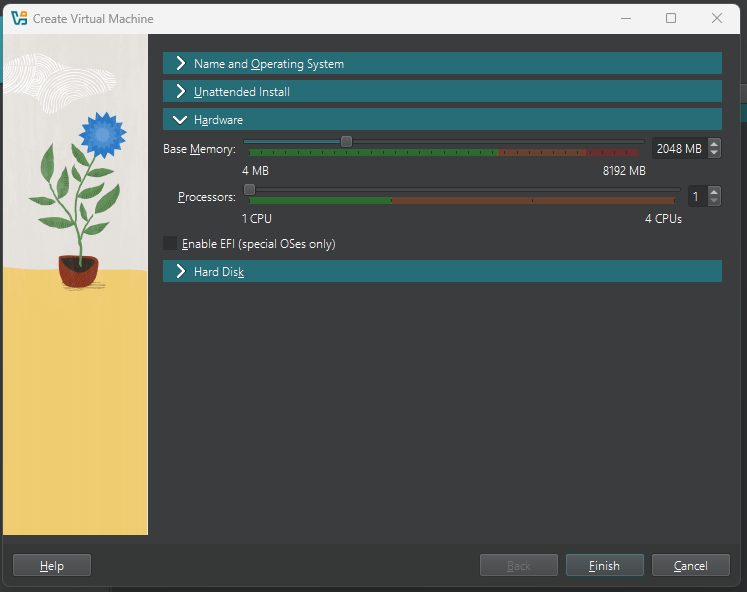
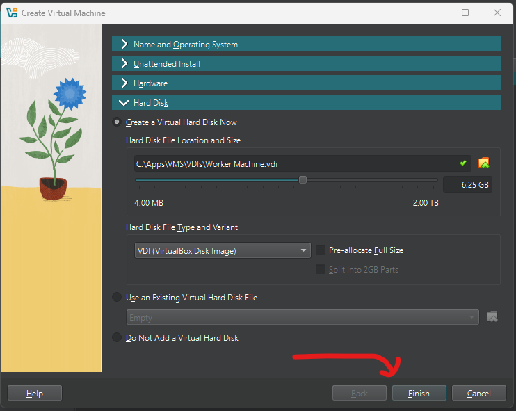
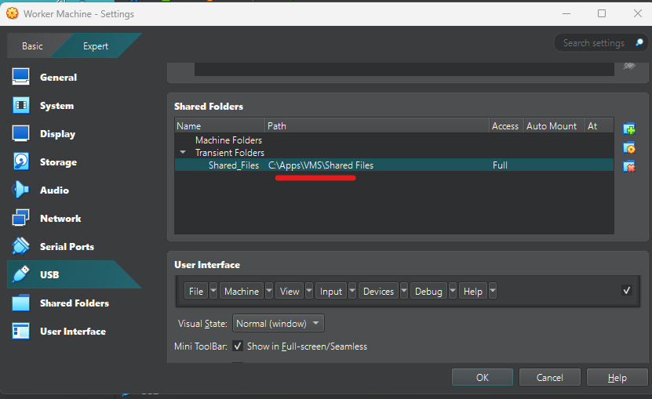
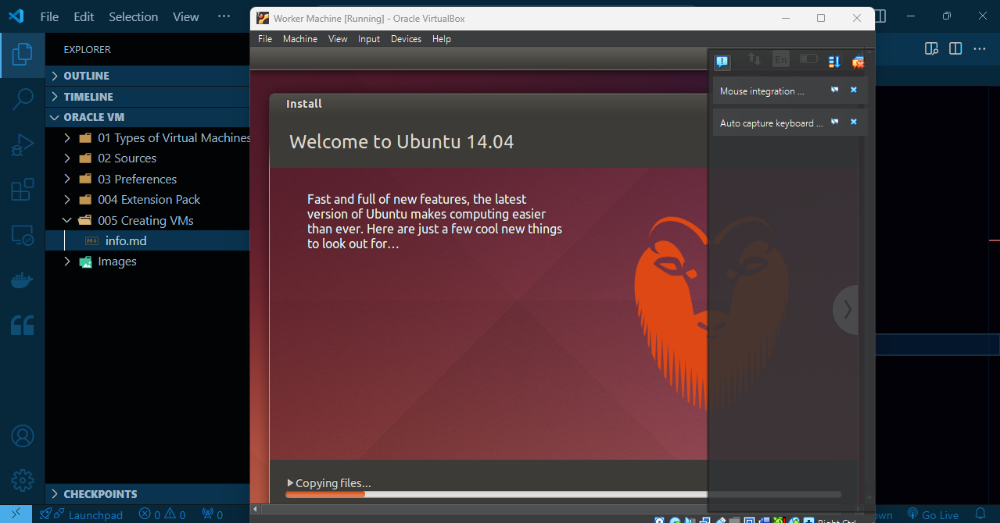

`Machine` -> `New`  
##### Preview:  
  
##### Preview:  
  
##### Preview:  
  
##### Preview:  
  
`Settings` -> `Shared Folder`  
##### Preview:  
  

Now it will initiate installation in background  
##### Preview:  
  
remember to remove or rename the ISO file from instance  