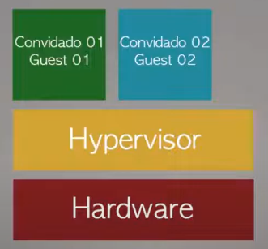
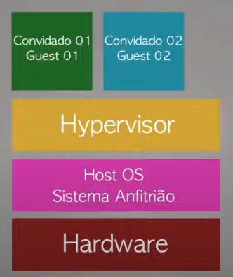

## type 01:  
when a normally lightweight and simplified system with no graphical interface is used only to manage as a monitor or hardware, providing an efficient, robust and redundant infrastructure ready to receive virtual servers or VDI, widely used in servers & data centers.  
#### Example :  
`Clitrix XenServer`, `HyperV`, `VMware ESXI`, `KVM`  
##### Preview:  
  

## type 02:  
when a virtual machines need virtualization software running on top of an operating system, commonly used for testing and isolating programs and networks  
#### Example :  
`VirtualBox`, `VMware Workstation`, `Parallels Desktop`
##### Preview:  
  