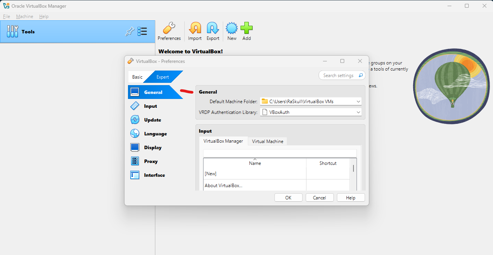
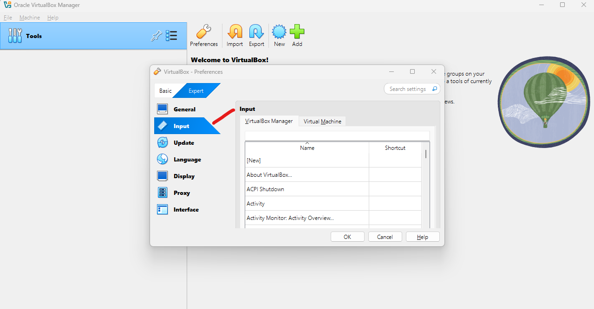
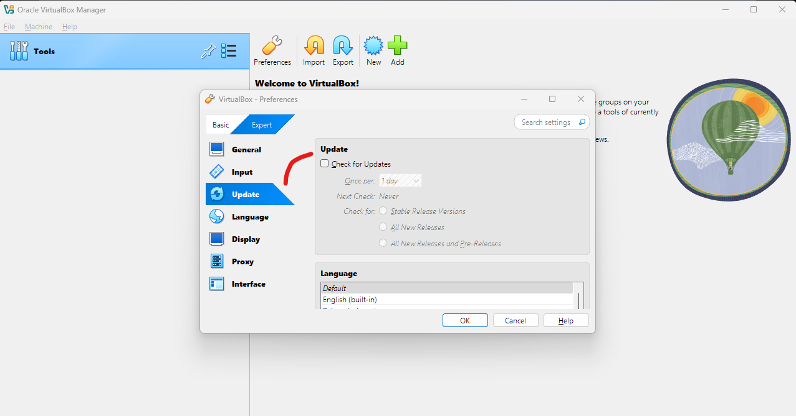
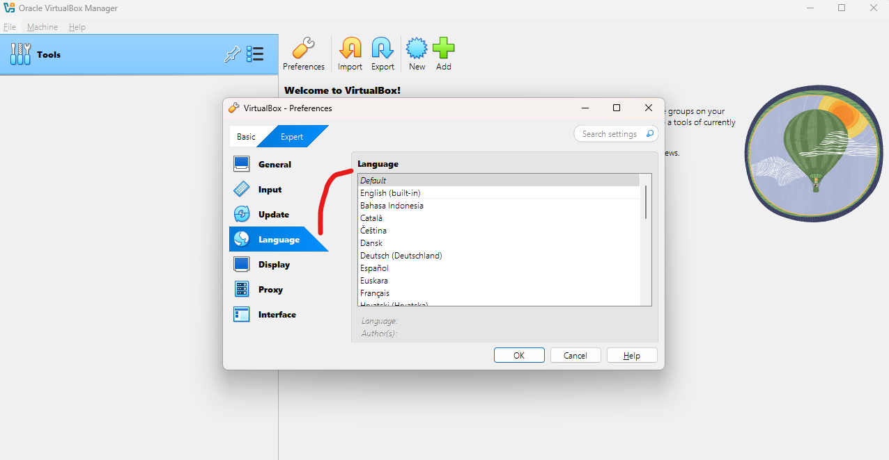
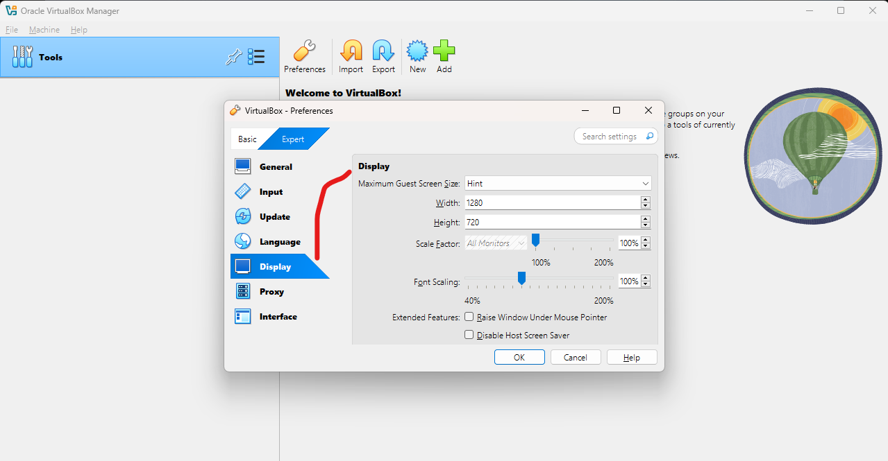
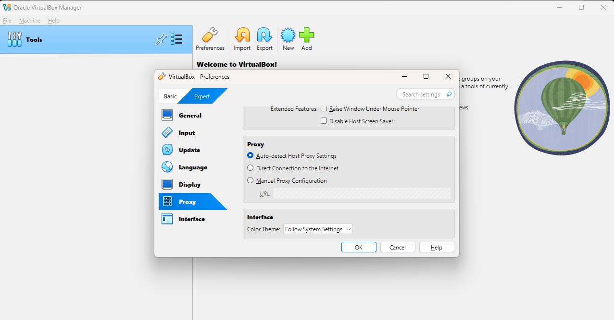
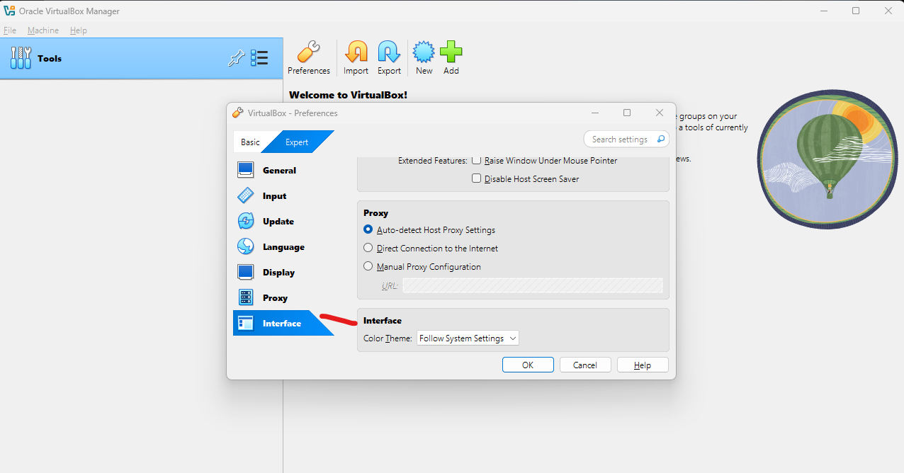

1. `File` -> `Prefernces` -> `General`  
##### Preview:  
  
manage the location of VMs & stuff  
2. `File` -> `Prefernces` -> `Input`  
##### Preview:  
  
manange the shortcuts & key bindings for VBox  
3. `File` -> `Prefernces` -> `Update`  
##### Preview:  
  
manages Updates  
4. `File` -> `Prefernces` -> `Languages`
##### Preview:  
  
manages Languages  
5. `File` -> `Prefernces` -> `Display`  
##### Preview:  
  
manages Display Settings  
6. `File` -> `Prefernces` -> `Proxy`  
##### Preview:  
  
manages Proxy Settings  
7. `File` -> `Prefernces` -> `Interface`
##### Preview:  
  
manages Interface Settings  